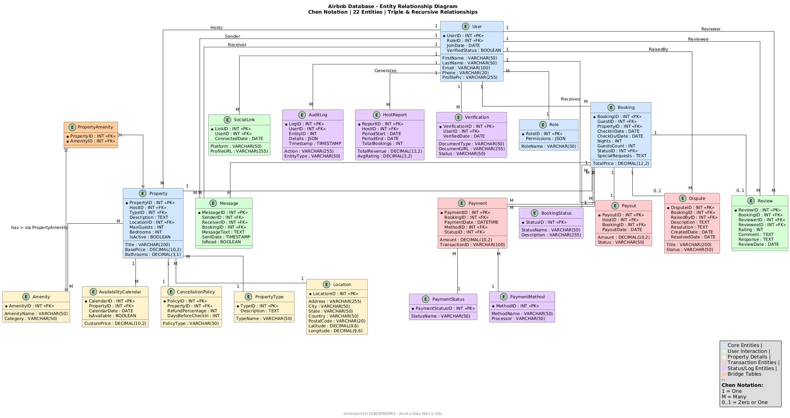

# 🏠 Airbnb Database System – Complete Data Mart Implementation

A fully normalized, production-ready relational database system for an Airbnb‑style property rental platform. This project demonstrates advanced SQL concepts including triple relationships, recursive relationships, stored procedures, triggers, and views.


---

## 📊 Entity Relationship Diagram



*Figure 1: Complete ER model with 22 entities, Chen notation, and cardinality specifications*

---

## 📋 Project Overview

This database system supports a fully functional property rental platform with:

| Feature | Description |
|---------|-------------|
| **User Roles** | Guests, Hosts, Admin, Support |
| **Property Management** | Listings, locations, amenities, availability calendars |
| **Booking Engine** | Reservations, status tracking, availability checks |
| **Payment Processing** | Multiple payment methods, transaction tracking, payouts |
| **Review System** | Guest-host ratings, comments, responses |
| **Communication** | Messaging between users |
| **Dispute Resolution** | Ticket system for issue management |
| **Audit Logging** | Complete action history |

---

## 🗄️ Database Schema – 22 Tables

### Core Entities
| Table | Description | Key Attributes |
|-------|-------------|----------------|
| `User` | Platform users (guests, hosts, admin) | UserID, RoleID, Name, Email, Phone, VerifiedStatus |
| `Role` | User roles and permissions | RoleID, RoleName, Permissions |
| `Location` | Property locations | LocationID, Address, City, Country, Coordinates |
| `PropertyType` | Types of accommodations | TypeID, TypeName, Description |

### Property Management
| Table | Description | Key Attributes |
|-------|-------------|----------------|
| `Property` | Property listings | PropertyID, HostID, Title, BasePrice, MaxGuests |
| `Amenity` | Available amenities | AmenityID, AmenityName, Category |
| `PropertyAmenity` | Bridge table (M:N) | PropertyID, AmenityID |
| `AvailabilityCalendar` | Date-based availability | CalendarID, PropertyID, Date, IsAvailable, CustomPrice |
| `CancellationPolicy` | Booking cancellation rules | PolicyID, PropertyID, RefundPercentage, DaysBeforeCheckin |

### Transactions
| Table | Description | Key Attributes |
|-------|-------------|----------------|
| `Booking` | Reservation records | BookingID, GuestID, PropertyID, Dates, TotalPrice, StatusID |
| `BookingStatus` | Booking states | StatusID, StatusName |
| `Payment` | Payment transactions | PaymentID, BookingID, Amount, MethodID, StatusID |
| `PaymentMethod` | Payment types | MethodID, MethodName, Processor |
| `PaymentStatus` | Payment states | PaymentStatusID, StatusName |
| `Payout` | Host earnings | PayoutID, HostID, BookingID, Amount, PayoutDate |

### User Interactions
| Table | Description | Key Attributes |
|-------|-------------|----------------|
| `Review` | Guest/host feedback (recursive) | ReviewID, BookingID, ReviewerID, RevieweeID, Rating, Comment |
| `Message` | User communications (recursive) | MessageID, SenderID, ReceiverID, MessageText, SentDate |
| `Dispute` | Issue tracking | DisputeID, BookingID, RaisedByID, Description, Status |

### System Management
| Table | Description | Key Attributes |
|-------|-------------|----------------|
| `AuditLog` | Action history | LogID, UserID, Action, EntityType, Timestamp |
| `SocialLink` | User social profiles | LinkID, UserID, Platform, ProfileURL |
| `HostReport` | Host performance metrics | ReportID, HostID, Period, TotalBookings, TotalRevenue, AvgRating |
| `Verification` | Identity verification | VerificationID, UserID, DocumentType, Status |

---

## 🔗 Key Relationships Implemented

### Triple Relationships
   1. Booking – Guest – Property
      └── Each booking connects a Guest (User) to a Property

   2. Payment – Booking – PaymentMethod
      └── Each payment connects a Booking to a specific PaymentMethod

   3. Review – Booking – User (Reviewer/Reviewee)
      └── Each review connects a Booking with both Reviewer and Reviewee


---

## 📊 Sample Data Statistics

| Table | Row Count | Table | Row Count |
|-------|-----------|-------|-----------|
| `User` | 24 | `Role` | 4 |
| `Property` | 22 | `Location` | 23 |
| `Booking` | 22 | `PropertyType` | 13 |
| `Payment` | 22 | `Amenity` | 28 |
| `Review` | 14 | `PropertyAmenity` | 47 |
| `Message` | 12 | `BookingStatus` | 6 |
| `Payout` | 22 | `PaymentMethod` | 6 |
| `Dispute` | 3 | `PaymentStatus` | 5 |
| `AuditLog` | 5 | `HostReport` | 5 |
| `SocialLink` | 5 | `CancellationPolicy` | 5 |
| `Verification` | 5 | `AvailabilityCalendar` | 24 |

**Total Database Size:** ~[X] MB *(Run query below to calculate)*

```sql
SELECT ROUND(SUM(data_length + index_length) / 1024 / 1024, 2) AS 'Size (MB)'
FROM information_schema.tables WHERE table_schema = 'airbnb_db';

## 🚀 Installation Guide
Prerequisites

    MySQL 8.0 or higher

    MySQL Workbench (recommended) or command line client

## Step-by-Step Setup
# 1. Clone the repository
git clone https://github.com/ipadeolaoluwatoyin7880/airbnb-sql-data-mart.git
cd airbnb-sql-data-mart

# 2. Create database and tables
mysql -u root -p < 01_create_database.sql
mysql -u root -p airbnb_db < 02_create_tables.sql

# 3. Insert sample data
mysql -u root -p airbnb_db < 03_insert_sample_data.sql

# 4. Test the implementation
mysql -u root -p airbnb_db < 04_test_queries.sql

# 5. Create views, procedures, triggers, functions
mysql -u root -p airbnb_db < 05_database_operations.sql

## Using MySQL Workbench

#  1. Open MySQL Workbench and connect to your server

#  2. File → Open SQL Script → Select each file in order

#  3. Execute (lightning bolt) for each file

## ⚡ Advanced Features
### Stored Procedures
-- Make a booking with automatic availability check
CALL sp_make_booking(1, 1, '2024-12-01', '2024-12-05', 2, 'Early check-in');

-- Process payment and update booking status
CALL sp_process_payment(1, 600.00, 1, 'TXN001');

### Triggers

    **trg_prevent_double_booking** – Ensures no overlapping bookings

    **trg_update_host_report** – Automatically updates host earnings reports

    **trg_booking_updated** – Maintains audit timestamps

### Functions
-- Calculate average rating for a property
SELECT fn_calculate_property_rating(1);

-- Check property availability for dates
SELECT fn_check_availability(1, '2024-12-01', '2024-12-05');

### Views
-- Property listings with host details and ratings
SELECT * FROM vw_property_listings;

-- Complete booking history with payment status
SELECT * FROM vw_booking_details;

-- Host performance dashboard
SELECT * FROM vw_host_dashboard;

## 🧪 Test Queries

### Verify triple relationships:
SELECT b.BookingID, CONCAT(u.FirstName, ' ', u.LastName) AS Guest,
       p.Title AS Property, bs.StatusName
FROM Booking b
JOIN User u ON b.GuestID = u.UserID
JOIN Property p ON b.PropertyID = p.PropertyID
JOIN BookingStatus bs ON b.StatusID = bs.StatusID
LIMIT 5;

## 📁 File Structure
airbnb-sql-data-mart/
├── 01_create_database.sql          # Database creation
├── 02_create_tables.sql             # 22 tables with constraints
├── 03_insert_sample_data.sql        # Sample data (20+ rows per table)
├── 04_test_queries.sql              # Relationship validation queries
├── 05_database_operations.sql       # Views, procedures, triggers, functions
├── ER_Diagram.png                    # Entity Relationship Diagram
└── README.md                         # This documentation

## 🎯 Learning Outcomes

This project demonstrates:

✅ **Database Design** – Normalization to 3NF, ER modeling with Chen notation
✅ **SQL Implementation** – DDL, DML, constraints, indexes
✅ **Advanced SQL** – Views, stored procedures, triggers, functions
✅ **Complex Relationships** – Triple relationships (3) and recursive relationships (2)
✅ **Data Integrity** – Foreign keys, check constraints, referential integrity
✅ **Business Logic** – Automated booking validation, payment processing
✅ **Documentation** – Complete technical documentation with screenshots

## 👤 Author
**Name:** IPADEOLA OLUWATOYIN ENIOLA
**Project:** Build a Data Mart in SQL
**GitHub:** ipadeolaoluwatoyin/airbnb-sql-data-mart

## 📜 License

This project is submitted as part of academic requirements for IU International University. All rights reserved.